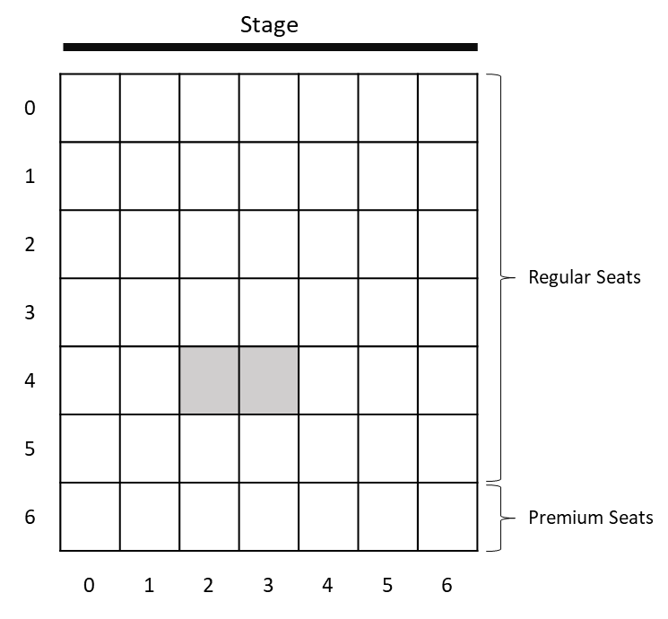
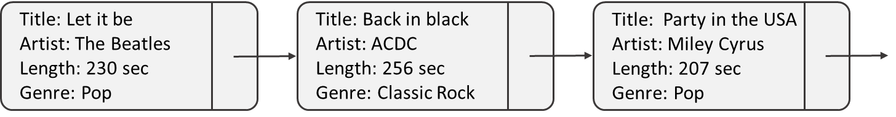
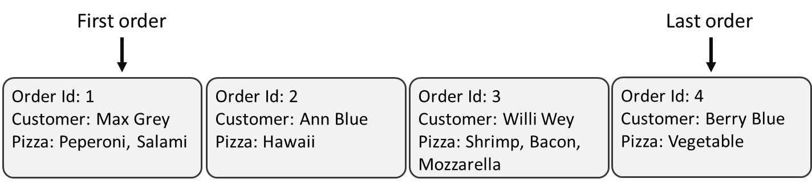

# Problem Plans
On this page, you can find three problem descriptions. 
These problems in a real-world context should be solved in a structured way. 
To solve them, formulate problem plans and detailed instructions in structured natural language (no need for programming languages). 
There is no specific notation that you have to follow. 
Think about the problems and how to decompose them. 

Good luck. 🙂

## Problem 1: Theatre Reservation
### Description
An independent theatre in Graz wants to renew the current reservation system, which is not working well anymore. 
They ask you to develop a new system. 
The theatre has theater halls of various sizes (e.g., 8x12, 7x7, 5x6, etc.). 
Some of the halls are additionally equipped with so-called *Premium* seats, which are more comfortable than *Regular* seats. 
Regular seats usually cost 7€ per ticket, and Premium seats are 9€. 
A theatre hall with two reserved seats is visualized in the following figure. 

#### Task 1
The function `count-available-seats` should count the number of seats not already reserved (= that have status reserved). 
It takes the theatre hall as a parameter. 
The function does not differentiate between different categories. 
It returns the total number of available seats.

#### Task 2
First, write a function `reserve-seats` that takes four parameters: i) the theater hall, ii) the row in which the seats are, iii) the first seat that should be reserved, and iv) the number of seats that should be reserved overall. 
Starting from the row specified as the second parameter, all required seats (fourth parameter) should be reserved to the right of the specified seat (third parameter). 
In the given example, the first parameter is 4 (fourth row), the second is 2 (starting with a seat in column 2), and the number of seats that should be reserved is 2. 
The seats should be marked as reserved if available (see exceptions below). This function returns the modified theater hall after the reservation. 
Even if the reservation is not possible (see exceptions below), the input lecture hall should be returned.

You should consider the following cases:

- The reservation cannot be processed if one of the requested seats is unavailable (= already reserved).
- If there are not enough seats in a row, no seats should be reserved (for example, if seven seats should be reserved beginning with seat 5).

#### Task 3
Write a function `purchase-ticket` with three parameters: i) the theater hall, ii) The number of tickets that should be purchased, and iii) the category (Regular or Premium). 
A regular ticket is 7€, and a premium ticket is 9€. 
The theatre operators want to reward visitors who buy their tickets early. 
For this reason, they wish to add 10% of the ticket price when the theatre hall occupancy rate is over 80%. 
For example, if 85% of the seats are already reserved in the theatre hall, a regular ticket costs 7.7€, and a premium ticket costs 9.9€. 
The function should return the total price of all purchased tickets.

## Problem 2: The Wedding Playlist
### Description
You are invited to the wedding of a good friend of yours.
Your friend knows that you have an excellent taste for music. 
For this reason, your friend asks you to create a playlist for the wedding. 
The guests prefer that the songs are well-balanced. 
So, you decided to create a playlist that is not shuffled (= songs are played in a pre-defined order) to balance those genres well. 

  
What are the attributes of a song?
  

    When thinking about songs, the most important information is the song title, artist(s), length (in seconds), and genre.

    
An element in the playlist consists of song-related data (see above), but an element also stores the information about which song comes next. 
So, each song has a reference to the next song.

A sample playlist consisting of three songs could have the following structure:

In this way, the list is not shuffled since the order is pre-defined.

#### Task 1
First, you need to write a function called `count-songs-by-genre` that runs through the playlist and counts the number of songs for a given genre within it.
The function takes two parameters: i) the very first element of the playlist (= starting song) and ii) the name of the genre. 
The first element is the starting point for searching, and the function goes through the playlist song by song. 
The function returns the total number of songs per genre in the list. 
You also have to consider two possible cases:

- The given playlist might be empty, meaning the function receives an empty list.
- There might be no songs of that genre in the genre. For example, the playlist above does not contain songs of the genre "*Punk*".

In both above-mentioned cases, the number of songs is 0.

#### Task 2
Next, write another function `calculate-total-playtime`, that runs through the list and counts the total playtime for the songs of the given genre. 
Again, the function takes two parameters: i) the beginning of the playlist and ii) the genre name. 
The function returns the total playtime in seconds. 
Similar to the previous function, you should consider that the list can be empty or that no songs of the given genre are in the list.

#### Task 3
Finally, write a function `is-playlist-balanced` that checks if the balance between the songs within the playlist is given. 
The function takes the start of the list (= first song) as a parameter.

To determine balance, follow these criteria:

- Calculate the difference in the number of songs between genres. This difference should not exceed 1.
- Calculate the total playtime for each genre. The time between different genres should not exceed 300 seconds (5 minutes).

The playlist is considered balanced if it meets these criteria. 
If the playlist is balanced, the function should return True; otherwise, it should return False.

In the case of the given playlist:

There are two songs of the genre *Pop* with a total playtime of 437 seconds (7:16 minutes) and one of the genre *Classic Rock* with a playtime of 256 seconds (4:15 minutes). 
The playlist is balanced because there is just the difference of one song (two pop songs and one classic rock song), and the time between both genres is less than 5 minutes.

### Problem 3: Pizza Delivery Service
#### Description
A local Italian restaurant wants to start an online ordering service. 
You are asked to write a program to manage pizza orders fairly within an order queue. 
The program should operate in a way that all orders are handled in sequence (the first order should be prepared first, chronologically, followed by the next order). 
Therefore, you must implement the order service to allow three functions: i) add a new order, i) cancel an existing order, and iii) process the current one.

#### Task 1
Write a function `new-order` where a new pizza order is taken. 
An order consists of three parameters: i) the very first order of the queue (Order Id) ii) the customer's name (Customer), and iii) a list of pizzas. 
The pizza list (third parameter) can contain at least one pizza and up to an infinite number of pizzas (although this might not be feasible in a real-life situation 😉). 
A new order should be added at the end of the queue: first come, first served. 
The function should return the new (= modified) ordering queue. 

#### Task 2
Write another function `cancel-order` that can cancel an existing order. 
The function should take two parameters: i) the first element of the order queue and ii) an order ID. 
The function deletes the order from the ordering queue. 
The function should return the new (= modified) ordering queue.

#### Task 3
Another function `process-order` should be written. 
This function takes just one parameter: the first element of the order queue. 
It processes (= prepares) the very first order in the queue and removes it from the queue. 
When the first order is processed, the following element (the second element) will be at the front of the ordering queue. 
The function should return the new (= modified) ordering queue. 
